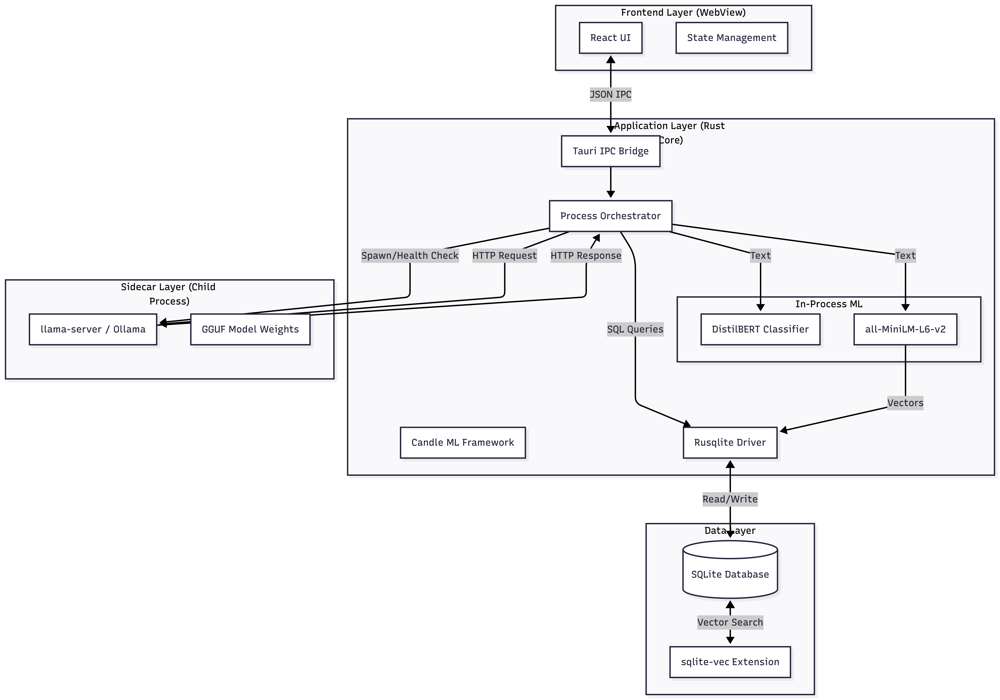

# MindScribe - Design Documentation

## 1. Overview

MindScribe is a **local-first AI journaling application** designed for mental wellness. It enables users to maintain a private journal while leveraging AI capabilities for emotional insights, reflective conversations, and semantic search—all without transmitting personal data to external servers.

### Key Value Proposition

- **Complete Data Sovereignty**: All data stays on the user's device. No cloud transmission, no third-party access.
- **Privacy-Preserving AI**: ML inference runs locally using small language models (SLMs) and embedded vector search.
- **GDPR Compliant by Design**: The user is both the Data Controller and Data Processor.
- **Offline-First**: Full functionality without internet connection (after initial model download).

---

## 2. Technical Stack

### Frontend
| Technology | Version | Purpose |
|------------|---------|---------|
| React | 19.1 | UI framework with concurrent features |
| TypeScript | 5.8 | Type-safe development |
| Tailwind CSS | 4.1 | Utility-first styling |
| TanStack Query | 5.90 | Server state management |
| Zustand | 5.0 | Client state management |
| Tauri v2 | 2.x | Desktop runtime with native WebView |

### Backend
| Technology | Version | Purpose |
|------------|---------|---------|
| Rust | 2021 Edition | High-performance backend orchestration |
| SQLite | 3.x | Single-file relational database |
| sqlite-vec | 0.1 | Vector similarity search extension |
| FTS5 | Built-in | Full-text search |

### Machine Learning
| Technology | Version | Purpose |
|------------|---------|---------|
| Candle | 0.8 | Rust-native ML framework (HuggingFace) |
| Ollama | External | Local LLM inference server |
| all-MiniLM-L6-v2 | - | 384-dim sentence embeddings (~90MB) |
| DistilBERT-GoEmotions | - | 28-emotion sentiment classification (~268MB) |
| Gemma 3 4B | - | Conversational AI via Ollama (~2.5GB) |

---

## 3. System Architecture



*Figure 1: MindScribe system architecture showing Frontend (WebView), Rust Core, Sidecar (Ollama), In-Process ML, and Data Layer*

---

## 4. Architecture Decisions

### 4.1 Why Tauri over Electron

Electron bundles Chromium and Node.js, resulting in 100MB+ installers and 200MB+ baseline memory usage. For a local AI application where the LLM may require 2-4GB of RAM, this overhead is unacceptable.

**Tauri advantages:**
- **Native WebViews**: Uses OS-provided rendering (WebView2/WebKit), reducing installer to ~10MB
- **Rust Backend**: Memory-safe orchestration without garbage collection overhead
- **Capability-Based Security**: Explicit permission model prevents frontend escapes
- **Lower Memory Footprint**: Leaves more RAM available for ML models

### 4.2 Why Local-First

Mental health data is inherently sensitive. Cloud-based AI journaling creates risks:
- Data breaches expose intimate thoughts
- Third-party monetization of personal data
- Regulatory compliance complexity (GDPR, HIPAA)
- Dependence on service availability

**Local-first guarantees:**
- Zero data egress (network isolated except for model downloads)
- No compliance burden—data never leaves the device
- Full offline functionality
- User trust through transparency

### 4.3 Why SQLite + sqlite-vec

Traditional RAG systems use external vector databases (Pinecone, Qdrant) requiring separate processes or cloud services.

**SQLite + sqlite-vec advantages:**
- **Single File**: Entire database (text + vectors) in one `.db` file
- **Easy Backup**: Copy one file to backup everything
- **ACID Compliance**: Transactions cover both text and vector operations
- **No External Process**: Vector search runs in-process
- **Sufficient Scale**: Exact KNN is fast for <100k vectors (decades of journaling)

**FTS5 integration:**
- BM25 keyword matching for specific entity searches
- Hybrid search combines semantic similarity with keyword precision
- Reciprocal Rank Fusion (RRF) merges results optimally

### 4.4 Why Ollama over Bundled Sidecar

The architectural blueprint recommended bundling `llama-server` as a sidecar. We chose Ollama instead:

| Aspect | Bundled Sidecar | Ollama |
|--------|-----------------|--------|
| Installer Size | +50MB binary, +2GB model | ~10MB app only |
| User Control | Hidden complexity | User manages models |
| Integration | Custom process management | Standard HTTP API |
| Updates | Rebuild app for engine updates | User updates Ollama |
| Flexibility | One model per build | Any Ollama-supported model |

**Trade-off**: Requires user to install Ollama separately, but provides setup instructions and status detection in the app.

### 4.5 Why TanStack Query + Zustand

React applications often conflate server state (data from backend) with client state (UI preferences). This causes unnecessary complexity and bugs.

**Separation of concerns:**

| Library | State Type | Examples |
|---------|------------|----------|
| TanStack Query | Server State | Journal entries, search results, emotions |
| Zustand | Client State | Selected entry, sidebar open, modal visibility |

**Benefits:**
- Automatic caching and invalidation for server data
- Optimistic updates for instant feedback
- Simple selectors for client state
- Minimal boilerplate compared to Redux

---

## 5. Database Design

### Schema Overview

```
┌─────────────────┐     ┌──────────────────────┐
│    journals     │     │   journal_emotions   │
├─────────────────┤     ├──────────────────────┤
│ id (PK)         │──┬──│ journal_id (FK)      │
│ title           │  │  │ emotion_label        │
│ content         │  │  │ confidence_score     │
│ entry_type      │  │  └──────────────────────┘
│ created_at      │  │
│ updated_at      │  │  ┌──────────────────────┐
│ is_archived     │  ├──│  journal_embeddings  │
└─────────────────┘  │  ├──────────────────────┤
                     │  │ journal_id (FK)      │
┌─────────────────┐  │  │ embedding[384]       │
│   templates     │  │  └──────────────────────┘
├─────────────────┤  │
│ id (PK)         │  │  ┌──────────────────────┐
│ name            │  └──│    chat_messages     │
│ description     │     ├──────────────────────┤
│ content         │     │ id (PK)              │
│ category        │     │ journal_id (FK)      │
│ is_default      │     │ role                 │
└─────────────────┘     │ content              │
                        │ created_at           │
                        └──────────────────────┘
```

### Key Tables

**journals**: Core entry storage with FTS5 indexing via triggers
```sql
CREATE TABLE journals (
    id TEXT PRIMARY KEY,
    title TEXT,
    content TEXT NOT NULL,
    entry_type TEXT,
    created_at TIMESTAMP DEFAULT CURRENT_TIMESTAMP,
    updated_at TIMESTAMP DEFAULT CURRENT_TIMESTAMP,
    is_archived BOOLEAN DEFAULT 0
);
```

**journal_embeddings**: Vector storage for semantic search
```sql
CREATE VIRTUAL TABLE journal_embeddings USING vec0(
    journal_id TEXT PRIMARY KEY,
    embedding FLOAT[384]
);
```

**chat_messages**: Per-entry conversation persistence
```sql
CREATE TABLE chat_messages (
    id TEXT PRIMARY KEY,
    journal_id TEXT NOT NULL,
    role TEXT NOT NULL,
    content TEXT NOT NULL,
    created_at TIMESTAMP DEFAULT CURRENT_TIMESTAMP,
    FOREIGN KEY(journal_id) REFERENCES journals(id) ON DELETE CASCADE
);
```

### FTS5 Synchronization

Triggers maintain full-text search index automatically:
- `journals_ai`: After INSERT, add to FTS
- `journals_au`: After UPDATE, update FTS
- `journals_ad`: After DELETE, remove from FTS

---

## 6. ML Pipeline

### Sentiment Model Architecture

<p align="center">
  
</p>

*Figure 2: DistilBERT GoEmotions classification pipeline - from token inputs through transformer backbone to 28 emotion probabilities*

### Embedding Generation

**Model**: `sentence-transformers/all-MiniLM-L6-v2`
- 384-dimensional dense vectors
- Optimized for semantic similarity
- ~90MB model size
- Runs in-process via Candle (no HTTP overhead)

**Process**:
1. User saves journal entry
2. Rust backend tokenizes content
3. Candle generates embedding in ~50ms
4. Vector stored in `journal_embeddings` table

### Sentiment Analysis

**Model**: `joeddav/distilbert-base-uncased-go-emotions-student`
- 28 emotion labels (GoEmotions taxonomy)
- Multi-label classification with confidence scores
- ~268MB model size

**Emotions detected**: Admiration, Amusement, Anger, Annoyance, Approval, Caring, Confusion, Curiosity, Desire, Disappointment, Disapproval, Disgust, Embarrassment, Excitement, Fear, Gratitude, Grief, Joy, Love, Nervousness, Optimism, Pride, Realization, Relief, Remorse, Sadness, Surprise, Neutral

### Hybrid Search (RAG)

Combines keyword and semantic search using Reciprocal Rank Fusion:

```
RRF_score(d) = Σ 1/(k + rank_i(d))
```

Where `k=60` is the smoothing constant.

**Process**:
1. User query → generate embedding
2. FTS5 search → ranked keyword matches
3. Vector search → ranked semantic matches
4. RRF combines both rankings
5. Top-N results injected into LLM context

---

## 7. Safety System

Mental health applications carry ethical responsibility. MindScribe implements a deterministic safety system that bypasses the LLM for crisis situations.

### Detection Levels

| Level | Trigger Examples | Behavior |
|-------|------------------|----------|
| **Crisis** | "suicide", "kill myself", "self-harm" | Hard block LLM, show modal with 988 hotline |
| **Distress** | "hopeless", "worthless", "give up" | Allow LLM, append support resources |
| **Safe** | Normal messages | Standard processing |

### Implementation

- **Regex-based detection**: Fast, deterministic, no false negatives
- **Hard-coded intervention**: Crisis response is NOT generated by AI
- **No logging of content**: User messages never written to logs
- **Resources localized**: Hotlines appropriate to user's region

### Crisis Modal Content

```
If you're having thoughts of suicide or self-harm, please reach out:

National Suicide Prevention Lifeline: 988 (US)
Crisis Text Line: Text HOME to 741741
International Association for Suicide Prevention: https://www.iasp.info/resources/Crisis_Centres/

You are not alone. These feelings can get better with support.
```

---

## 8. Key Features Summary

### Journal Management
- Create, edit, archive, delete entries
- Auto-save with 1-second debounce
- Save status indicator (Unsaved → Saving → Saved)
- Cmd+S/Ctrl+S for immediate save
- Image attachments via drag-and-drop or paste

### Dashboard Analytics
- Current streak and longest streak tracking
- 7-day emotion visualization
- Monthly calendar heatmap
- "On This Day" historical entries
- Daily rotating journaling prompts
- Entry statistics (total, week, month)

### AI Companion
- Contextual sidepanel in editor (collapsed by default)
- Per-entry conversation persistence
- Quick actions: Reflect, Expand, Reframe
- RAG-powered context from past entries
- Streaming responses via Tauri events
- Safety intervention for crisis/distress

### Search
- Hybrid search (keyword + semantic)
- Debounced search input (300ms)
- Archive filtering
- Emotion-based filtering

### Template System
- Pre-built journaling templates
- Category organization
- One-click entry creation from template

---

## 9. Testing Strategy

### Unit Tests (Rust)

**Coverage**: 20+ tests across modules

| Module | Tests |
|--------|-------|
| `db::journals` | CRUD, search, archive, date range queries |
| `db::vectors` | Vector storage, similarity search, blob conversion |
| `db::search` | RRF calculation, hybrid search |
| `llm::safety` | Crisis detection, distress detection, case insensitivity |
| `db::chat` | Message CRUD, cascade delete |

### Type Checking (TypeScript)

- Strict mode enabled (`"strict": true`)
- No implicit any
- Null checks enforced
- Run via `pnpm lint` (alias for `tsc --noEmit`)

### Manual QA Checklist

1. Create entry → appears immediately (optimistic update)
2. Edit entry → auto-saves after pause
3. Search → results update with debounce
4. Archive → card shows muted styling
5. Delete → confirmation dialog → removed
6. Close while typing → changes saved
7. Crisis keyword → modal appears, LLM blocked
8. Chat → responses stream in real-time
9. Dashboard → streaks calculated correctly
10. Ollama offline → setup banner shown

### Build Verification

```bash
cargo fmt --check     # Rust formatting
cargo clippy          # Rust lints
cargo test            # Rust unit tests
pnpm build            # TypeScript compilation
pnpm tauri build      # Full app bundle
```

---

## 10. Security Considerations

### Data Protection
- **At Rest**: SQLCipher encryption available (on `feat/security` branch)
- **In Transit**: N/A—no data leaves localhost
- **Network Isolation**: Tauri allowlist restricts HTTP to update servers only

### Privacy Guarantees
- User content never logged
- No telemetry or analytics
- Model inference entirely local
- Backup files encrypted with user password

### Future Security (Implemented on separate branch)
- Keychain integration for key storage
- Touch ID / Face ID unlock
- Auto-lock after inactivity
- PIN fallback option

---

## 11. Project Structure

```
mindscribe/
├── src/                          # React frontend
│   ├── components/
│   │   ├── chat/                 # AI companion UI
│   │   ├── dashboard/            # Analytics dashboard
│   │   ├── journal/              # Editor, entry list
│   │   ├── layout/               # AppShell, sidebar
│   │   ├── templates/            # Template system
│   │   └── ui/                   # Shared components
│   ├── hooks/                    # React Query + custom hooks
│   ├── stores/                   # Zustand stores
│   ├── types/                    # TypeScript interfaces
│   └── lib/                      # Utilities
│
├── src-tauri/                    # Rust backend
│   └── src/
│       ├── db/                   # Database operations
│       │   ├── mod.rs            # Connection pool
│       │   ├── schema.rs         # Migrations
│       │   ├── journals.rs       # Entry CRUD
│       │   ├── emotions.rs       # Emotion storage
│       │   ├── vectors.rs        # Vector operations
│       │   ├── search.rs         # Hybrid search
│       │   ├── chat.rs           # Message persistence
│       │   └── templates.rs      # Template CRUD
│       ├── ml/                   # Machine learning
│       │   ├── mod.rs            # ML state management
│       │   ├── models.rs         # Model downloading
│       │   ├── embeddings.rs     # MiniLM embeddings
│       │   └── sentiment.rs      # GoEmotions classifier
│       ├── llm/                  # LLM integration
│       │   ├── mod.rs            # LLM state
│       │   ├── ollama.rs         # Ollama HTTP client
│       │   ├── chat.rs           # Chat service + RAG
│       │   └── safety.rs         # Crisis detection
│       ├── error.rs              # Error types
│       └── lib.rs                # Tauri commands
│
├── assets/                       # Documentation assets
│   ├── arch.png                  # System architecture diagram
│   ├── ml.png                    # ML pipeline diagram
│   └── technical_doc.md          # API specifications
└── DOCUMENTATION.md              # This file
```

---

## 12. References

- [Tauri v2 Documentation](https://v2.tauri.app)
- [sqlite-vec](https://github.com/asg017/sqlite-vec)
- [Candle ML Framework](https://github.com/huggingface/candle)
- [Ollama](https://ollama.ai)
- [GoEmotions Dataset](https://github.com/google-research/google-research/tree/master/goemotions)
- [Reciprocal Rank Fusion](https://plg.uwaterloo.ca/~gvcormac/cormacksigir09-rrf.pdf)
